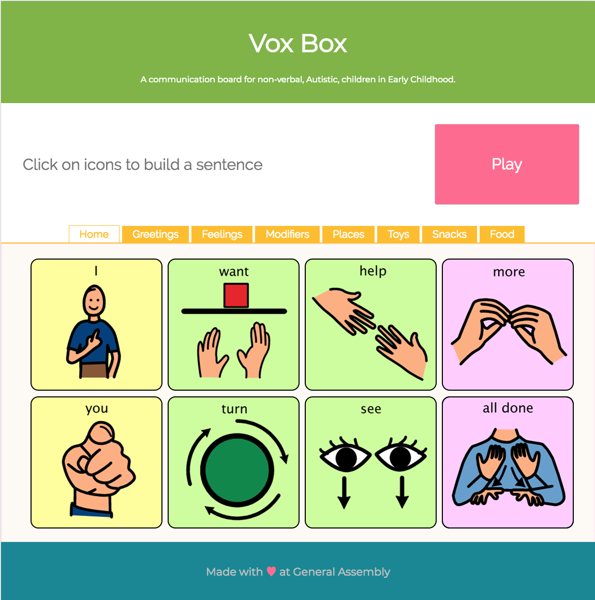
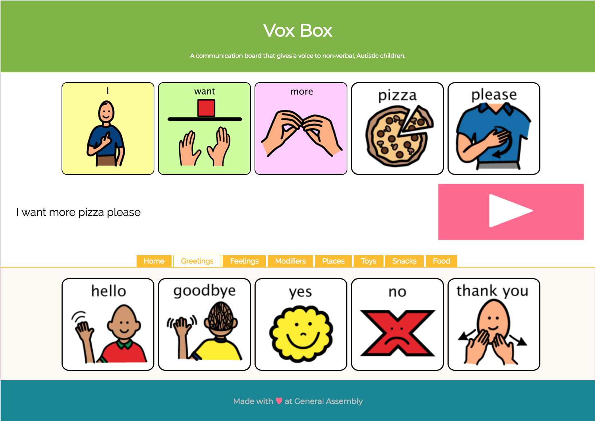

# VoxBox 

Speaking is how we as adults communicate with the people around us. It allows us to interact with each other, influcence the world around us, and get our needs met. But for many children with autism, speech is not an option. Nearly a third of the people on the autism spectrum use no spoken language or only a few words. Many of the tools currently out there are aimed towards older children and adults. This app is aimed to give a voice to young children who do not yet have one.

## Getting Started

* Fork and clone this repo in your terminal: git clone https://github.com/so-chow/voxbox-react.git
* Change directory into the same directory as this project. cd voxbox-react
* npm intall to install dependencies.
* npm start to run in localhost:3000

    or visit [VoxBox](https://voxbox-709f7.firebaseapp.com/) on Firebase!

# Technologies Used
    
* React.js
* Firebase for deployment

## How To Use

When you launch the site, there are several category tabs a child can choose from to find words he/she needs. When you click on a card, it will render both on a picture card sentence strip and the actual words. Once the child has created their sentence, they can press play, and their sentence will be read aloud to them! If they child has accidentelly chosen an incorrect word, they can simply press on the picture card and it will be put back into it's respective category container. 

This app will not only teach a child the patterns of forming a sentence, but will teach them that their words can be spoken!

Once the child understands the patterns of how to navigate through this site, they can begin to start building more complex sentences like so:

## Additional Features
* Ability to add your own word card(s).
* Create a reset button
* Ability to have a non-child proof version where you can also type in a word on the input.
* Ability to have a log-in option where the app renders words that the child uses most frequently into the home page.
* Adding more cards/words into images.json

### Made By: Sophia Chow
I hope this app helps you bring a voice to children without one! :heartbeat:

